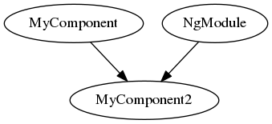

## Synopsis

Generate a simple dependency graph of Angular modules (JavaScript (ES6)).

## Code Example

Ngmodep . dependecy.dot

## Motivation

Haskell learning toy project.

## Installation

stack install

## Tests

stack test

## Further ideas
- Improve exception handling
- Implement full JS import / export api

## License

A short snippet describing the license (MIT, Apache, etc.)